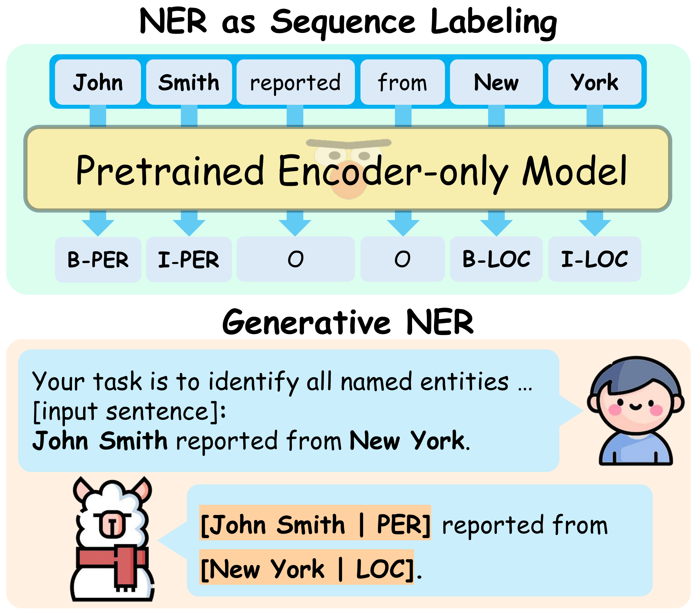
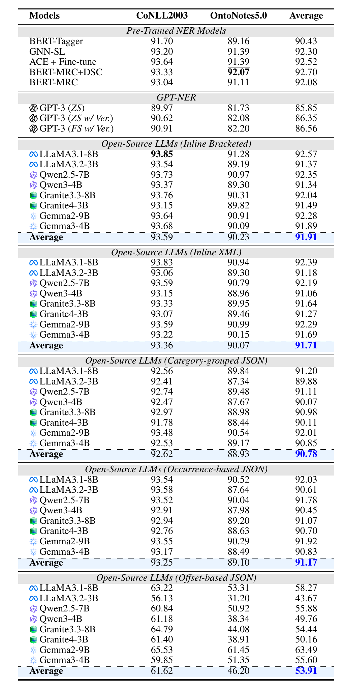
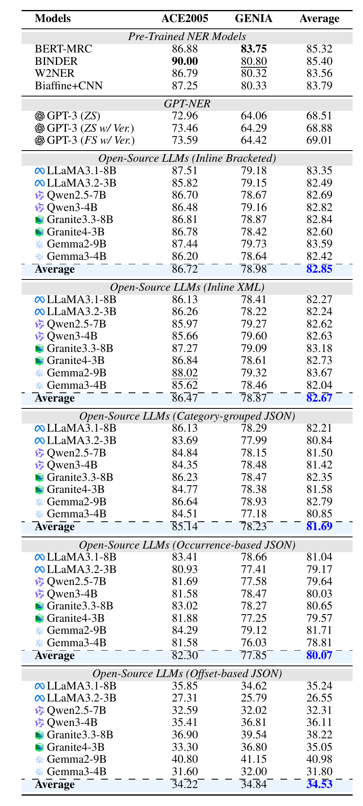

<div align="center">
  
# Assessment of Generative Named Entity Recognition in the Era of Large Language Models

[](https://arxiv.org/abs/2601.17898)
[](https://github.com/szu-tera/LLMs4NER)

<div align="center" style="font-family: Arial, sans-serif;">
  <p>
    <a href="#news" style="text-decoration: none; font-weight: bold;">🎉 News</a> •
    <a href="#overview" style="text-decoration: none; font-weight: bold;">📌 Overview</a> •
    <a href="#main-results" style="text-decoration: none; font-weight: bold;">📊 Main Results</a>
  </p>
  <p>
    <a href="#getting-started" style="text-decoration: none; font-weight: bold;">✨ Getting Started</a> •
    <a href="#evaluation" style="text-decoration: none; font-weight: bold;">📃 Evaluation</a>  •
    <a href="#contact" style="text-decoration: none; font-weight: bold;">📨 Contact</a> •
    <a href="#citation" style="text-decoration: none; font-weight: bold;">🎈 Citation</a>
  </p>
</div>

</div>

## 🎉News
- **[2026/1]** We release our paper and code repo.

---

## 📌Overview

Named entity recognition (NER) is evolving from a sequence labeling task into a generative paradigm with the rise of large language models (LLMs). In this work, we conduct a systematic assessment of open-source LLMs on both flat and nested NER tasks.

<div align="center">
  
</div>

Specifically, we investigate four research questions:

- **RQ1 — Performance.** Is generative NER with open-source LLMs a reliable approach compared with advanced pre-trained (encoder-based) NER models?
- **RQ2 — Output format.** How do different output formats affect generative NER? We design five formats: *Inline Bracketed*, *Inline XML*, *Category-grouped JSON*, *Occurrence-based JSON*, and *Offset-based JSON*.
- **RQ3 — Recognition or memorization.** Do LLMs rely on memorization of entity labels to solve NER tasks?
- **RQ4 — General capability.** Do LLMs preserve the original capabilities after instruction tuning for NER?

Through experiments across eight LLMs of varying scales and four standard NER datasets, we find that:

1. With parameter-efficient fine-tuning and structured formats like inline bracketed or XML, open-source LLMs achieve performance competitive with traditional encoder-based models and surpass decoder-based LLMs with in-context learning techniques.
2. The NER capability of LLMs stems from instruction-following and generative power, not mere memorization of entity-label pairs.
3. Applying NER instruction tuning has minimal impact on general capabilities of LLMs, even improving performance on datasets like DROP by 25.50 to 45.32 F1 points due to enhanced entity understanding.

These findings demonstrate that generative NER with LLMs is a promising, user-friendly alternative to traditional methods.

---

## 📊Main Results

We report Micro-F1 scores to compare advanced pre-trained NER models, closed-source LLMs with in-context learning, and open-source LLMs across different output formats for both flat and nested NER.

- **Flat NER**

<div align="center">
  
</div>

- **Nested NER**

<div align="center">
  
</div>

---

## ✨Getting Started

Clone our repository and install the required environment:

```shell
# Clone the repository
git clone https://github.com/szu-tera/LLMs4NER.git
cd LLMs4NER

# Install the required environment
conda create -n LLMs4NER python=3.10
conda activate LLMs4NER
git clone --depth 1 https://github.com/hiyouga/LLaMA-Factory.git
cd LLaMA-Factory
pip install -e ".[metrics]"
```

Dataset preparation: We employ [LLaMA-Factory](https://github.com/hiyouga/LLaMA-Factory) for fine-tuning. You need to replace the `data` folder in the `LLaMA-Factory` repository with our provided version to use datasets. You can set them up using the following commands:

```shell
rm -rf ./LLaMA-Factory/data
cp -r ./data ./LLaMA-Factory/data
```

Training and Inference:

```shell
# Run lora fine-tuning
bash train/run_lora.sh

# Run inference
bash inference/run_inference.sh
```

## 📃Evaluation

After running the inference script, you can evaluate the results using the codes provided in the `evaluation` folder. The script calculates precision, recall, and Micro-F1 scores for NER outputs.

```shell
python evaluation/eval_bracketed_ner.py \
    --file /path/generated_predictions.jsonl \
    --preset conll2003 # dataset
```

*   `--file` (required): Path to the `generated_predictions.jsonl` file produced by the inference script.
*   `--preset` (required): The dataset preset to use for per-label reporting.
*   `--labels` (optional): An explicit list of labels to report on, separated by spaces. If not provided, the script will use the labels defined by the `--preset`.
*   `--output_dir` (optional): The directory where the evaluation results (`results.json`) will be saved. Defaults to the same directory as the input `--file`.

Evaluate the generation ability of the fine-tuned model:

```shell
git clone --depth 1 https://github.com/EleutherAI/lm-evaluation-harness
cd lm-evaluation-harness
pip install -e .
pip install "lm_eval[hf]"

lm-eval run --config evaluation/eval_config.yaml # evaluate
```

---

## 📨Contact

- Qi Zhan: qzhan65@gmail.com

---

## 🎈Citation

If you find this work useful for your research, please consider citing our paper:
```bibtex
@article{zhan2026assessmentgenerativenamedentity,
  title={Assessment of Generative Named Entity Recognition in the Era of Large Language Models},
  author={Zhan, Qi and Wang, Yile and Huang, Hui},
  journal={arXiv preprint arXiv:2601.17898},
  year={2026}
}
```
